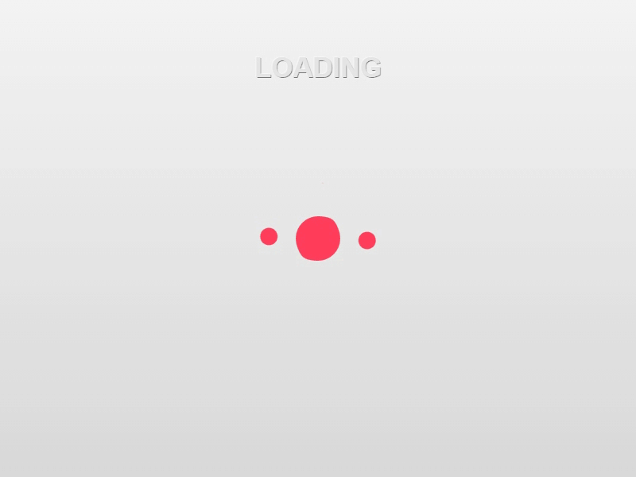
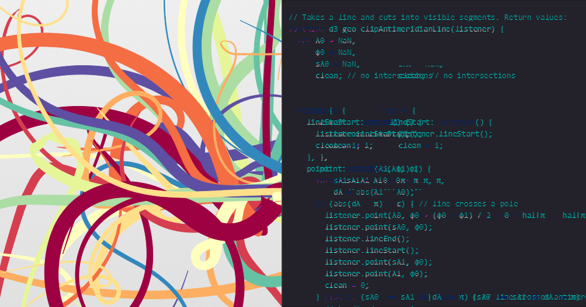

**It's still in progress, I couldn't have time to clean and comment to code and finish documentation.**

# cihadturhan.com
> Interactive portfolio of Cihad Turhan which includes WebGL, D3, CSS3 and other visual demos.
Personal online portfolio which I listed skills, interests, works and experiments in interactive and fun way. Shortlisted in [Net Awards 2015](https://thenetawards.com/) - Best Online Portfolio category.

## Table of contents
1. General Structure
  1. Design Logic And Philosophy
  1. Development Strategy

1. Pages
  1. Design Logic And Philosophy
    1. Loading
    1. Introduction
    1. Skills
    1. Works
    1. Lab
    1. About
    1. Contact
  1. Development
    1. Loading
    1. Introduction
    1. Skills
    1. Works
    1. Lab
    1. About
    1. Contact

1. License

1. Contact

---
## 1. General Structure
### 1.1. Design Logic And Philosophy
Portfolio consists of seven different full width and height pages. Website welcomes user with loading page and preloads all the scripts, styles and other assets. When all loading finishes, it automatically scrolls to `intro` page and removes loading page.

#### Layout
I tried to keep the following structure on the pages:
- Left section: Design-related element with interactive features.
- Right section: Code and technical information.
- Header section: Navigation links
- Bottom section: Next buttons

You can find out the utilization of the idea on `Introduction`, `Skills` and `Works` pages.


#### Colors
Color Palette is chosen from three vivid and primary colors - `hsl(350, 100%, 62%)`, `hsl(164, 100%, 40%)` and `hsl(204, 100%, 52%)`.

For background, three shades of `hsl(249, 14%, 30%)` and `hsl(0, 0%, 90%)` used.


#### Typography

Typefaces chosen from [Proxima Nova](http://www.myfonts.com/fonts/marksimonson/proxima-nova/) for headings and [Rooney Sans](https://www.myfonts.com/fonts/jan-fromm/rooney-sans/) for texts.


### 1.2. Development Strategy

Website built on PHP and plain CSS and Javascript.

It uses different plugins to benefit their own features. For example, jQuery for DOM manipulation, D3.js for SVG interactions, THREE.js for 3D rendering and animation, GSAP TweenMax for performant animations.

#### Mobile Detection
[Mobile Detect](https://github.com/serbanghita/Mobile-Detect) library is a very simple plugin to detect device.

```php
<?php
$detect = new Mobile_Detect;
$isMobile = $detect->isMobile();
?>
```


It adds different array of scripts and section of the webpage according to device is mobile or not i.e.

```php
<?php if ($isMobile):?>
  <script type="text/javascript" src="app.mobile.js"></script>
<?php else:?>
  <script type="text/javascript" src="app.js"></script>
<?php endif ?>
```


### Build

Grunt is used to minify and optimize Javascript and CSS files.

It fetches all the files from `dirs.json` and `dirs.json` to concatenate and uglify.

```javascript
{
  dirs: grunt.file.readJSON('dirs.json')
}
```
I always work and debug with source files so I created a different build structure. There is a separate JSON file –  [dirs.json](dirs.json) which has the list of all files for desktop and mobile version. If I use `DEV` in `config.php`, files are served one by one. Otherwise, I use `DIST` property and it prints only minified JavaScript and CSS files. All the required script and styles are added in dirs.json.


#### Preloader
It uses two different loader for preloading. [pxLoader](http://thinkpixellab.com/pxloader/) for images and [lazyload.js]() for scripts and css files. I allocated empirical percentage for image, script and style files and adjust the arc of the loading circle.


## 2. Pages
### 2.1. Design Logic And Philosophy
#### 2.1.1. Loading
Scene starts with two horizontal lazy lines moving symmetrically. An arc starts and complete a circle which represents how much of the content is loaded. Meanwhile, a goo animation of 6 small and one big circles are added to keep visitor's attention on scene. Loading animation was inspired by one of the old experiments done by [Sharp & Nimble](http://sharpandnimble.com/experiments)



After loader passes, user is welcomed with a fixed width introductory text introducing me and what I am doing.

#### 2.1.2. Introduction

The key idea to surprise the visitor at these scene. Left side represents design whereas right one represents code. User sees a **colorful tentacle animation** on the left and a **glitch animation** on the right section.



#### 2.1.3. Skills

Skills chart is what I experimented and satisfied with the result. Basically it's a radar chart, but in 3D!


#### 2.1.4. Works
#### 2.1.5. Lab
#### 2.1.6. About
#### 2.1.7. Contact
---
### 2.2. Development Strategy
#### 2.2.1. Loading
#### 2.2.2. Introduction
#### 2.2.3. Skills
#### 2.2.4. Works
#### 2.2.5. Lab
#### 2.2.6. About
#### 2.2.7. Contact

## 3. License

The MIT License (MIT)

Copyright (c) 2015 Cihad Turhan

Permission is hereby granted, free of charge, to any person obtaining a copy
of this software and associated documentation files (the "Software"), to deal
in the Software without restriction, including without limitation the rights
to use, copy, modify, merge, publish, distribute, sublicense, and/or sell
copies of the Software, and to permit persons to whom the Software is
furnished to do so, subject to the following conditions:

The above copyright notice and this permission notice shall be included in all
copies or substantial portions of the Software.

THE SOFTWARE IS PROVIDED "AS IS", WITHOUT WARRANTY OF ANY KIND, EXPRESS OR
IMPLIED, INCLUDING BUT NOT LIMITED TO THE WARRANTIES OF MERCHANTABILITY,
FITNESS FOR A PARTICULAR PURPOSE AND NONINFRINGEMENT. IN NO EVENT SHALL THE
AUTHORS OR COPYRIGHT HOLDERS BE LIABLE FOR ANY CLAIM, DAMAGES OR OTHER
LIABILITY, WHETHER IN AN ACTION OF CONTRACT, TORT OR OTHERWISE, ARISING FROM,
OUT OF OR IN CONNECTION WITH THE SOFTWARE OR THE USE OR OTHER DEALINGS IN THE
SOFTWARE.

## 4. Contact

If you need any questions or have offers, please reach me from following channels
- contact[at]cihadturhan.com
- [@cihadturhan](https://twitter.com/cihadturhan)
- [f/cihadturhan](https://www.facebook.com/cihad.turhan)
