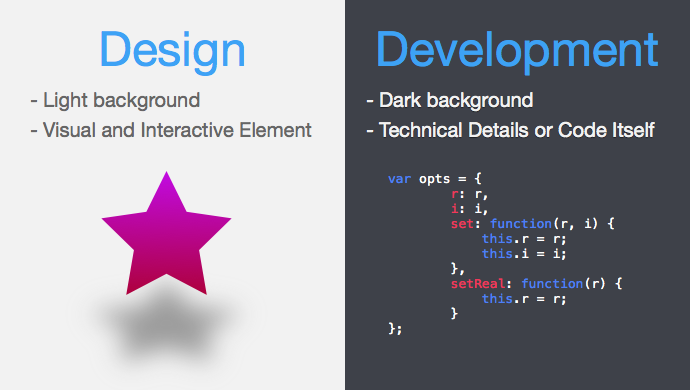
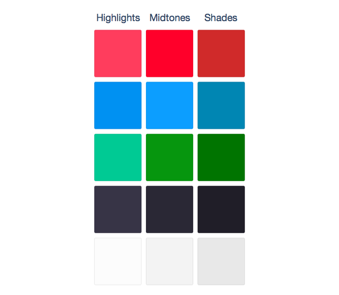
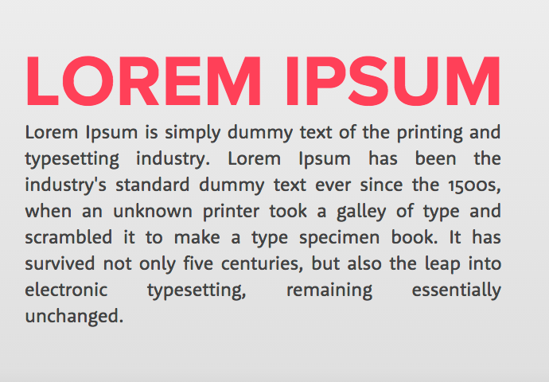
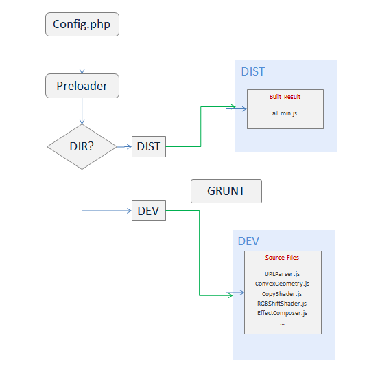

# cihadturhan.com
Personal online portfolio which I listed skills, interests, works and experiments in interactive and fun way. Shortlisted in [Net Awards 2015](https://thenetawards.com/) - Best Online Portfolio category.

## Table of contents
1. General Structure
  1. Design Logic And Philosophy
  1. Development Strategy

1. Pages
  1. Design Logic And Philosophy
    1. Loading
    1. Introduction
    1. Skills
    1. Works
    1. Lab
    1. About
    1. Contact
  1. Development
    1. Loading
    1. Introduction
    1. Skills
    1. Works
    1. Lab
    1. About
    1. Contact

---
## 1. General Structure
### 1.1. Design Logic And Philosophy
Portfolio consists of seven different full width and height pages. Website welcomes user with loading page and preloads all the scripts, styles and other assets. When all loading finishes, it automatically scrolls to `intro` page and removes loading page.

#### Layout
I tried to keep the following structure on the pages:
- Left section: Design-related element with interactive features.
- Right section: Code and technical information.
- Header section: Navigation links
- Bottom section: Next buttons

You can find out the utilization of the idea on `Introduction`, `Skills` and `Works` pages.



#### Colors
Color Palette is chosen from three vivid and primary colors - `hsl(350, 100%, 62%)`, `hsl(164, 100%, 40%)` and `hsl(204, 100%, 52%)`.

For background, three shades of `hsl(249, 14%, 30%)` and `hsl(0, 0%, 90%)` used.



#### Typography

Typefaces chosen from [Proxima Nova](http://www.myfonts.com/fonts/marksimonson/proxima-nova/) for headings and [Rooney Sans](https://www.myfonts.com/fonts/jan-fromm/rooney-sans/) for texts.




### 1.2. Development Strategy

Website built on PHP and plain CSS and Javascript.

It uses different plugins to benefit their own features. For example, jQuery for DOM manipulation, D3.js for SVG interactions, THREE.js for 3D rendering and animation, GSAP TweenMax for performant animations.

#### Mobile Detection
[Mobile Detect](https://github.com/serbanghita/Mobile-Detect) library is a very simple plugin to detect device.

```php
<?php
$detect = new Mobile_Detect;
$isMobile = $detect->isMobile();
?>
```


It adds different array of scripts and section of the webpage according to device is mobile or not i.e.

```php
<?php if ($isMobile):?>
  <script type="text/javascript" src="app.mobile.js"></script>
<?php else:?>
  <script type="text/javascript" src="app.js"></script>
<?php endif ?>
```


### Build

Grunt is used to minify and optimize Javascript and CSS files.

It fetches all the files from `dirs.json` and `dirs.json` to concatenate and uglify.

```javascript
{
  dirs: grunt.file.readJSON('dirs.json')
}
```
[dirs.json](dirs.json) has the list of all files, so if a new script is required it's added here.





#### Preloader
It uses two different loader for preloading. [pxLoader](http://thinkpixellab.com/pxloader/) for images and [lazyload.js]() for scripts and css files. I allocated empirical percentage for image, script and style files and adjust the arc of the loading circle.


## 2. Pages
### 2.1. Design Logic And Philosophy
#### 2.1.1. Loading
#### 2.1.2. Introduction
#### 2.1.3. Skills
#### 2.1.4. Works
#### 2.1.5. Lab
#### 2.1.6. About
#### 2.1.7. Contact
---
### 2.2. Development Strategy
#### 2.2.1. Loading
#### 2.2.2. Introduction
#### 2.2.3. Skills
#### 2.2.4. Works
#### 2.2.5. Lab
#### 2.2.6. About
#### 2.2.7. Contact
